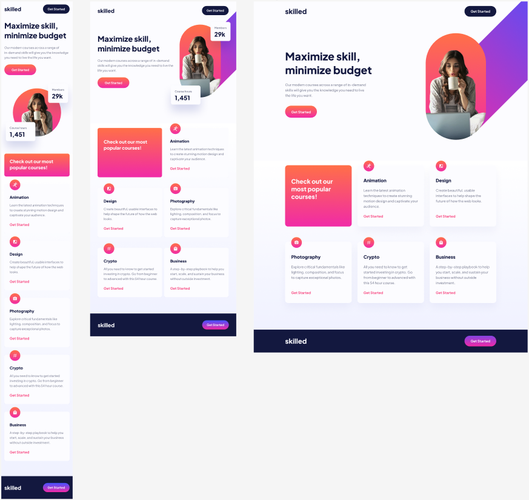

<h1 align="center" style="color: #0366d6;">
   LandingPro: Maestría Responsiva al Descubierto 🌐
</h1>

Este proyecto presenta un ejemplo de una landing responsive desarrollado con HTML y Sass, diseñado para adaptarse de manera óptima a dispositivos móviles, tablets y pantallas de escritorio en diferentes tamaños.

---

  

---

## Características Principales 🚀

- **Totalmente Responsive:** 📱💻 El header se ajusta de forma dinámica para ofrecer la mejor experiencia de usuario en dispositivos móviles, tablets y escritorios.

- **Diseño Fluid Grid:** 🎨 Utiliza un diseño basado en un grid fluido para garantizar que el contenido se adapte a diferentes tamaños de pantalla de manera elegante.

- **Media Queries:** 🖥️ Se han implementado media queries para optimizar la presentación en dispositivos específicos, como:

  - Tablets (768px)
  - Tablets horizontales (1024px)
  - Pantallas de escritorio (1200px)
  - Desktops XL (1440px)

## Tecnologías Utilizadas ⚙️

- **HTML:** 📝 El markup semántico se ha implementado para mejorar la accesibilidad y facilitar el mantenimiento del código.
- 

- **Sass:** 🎨 Se ha utilizado Sass para organizar y modularizar el código CSS, mejorando la legibilidad y facilitando futuras expansiones.
- 

---

  

## Contribuciones 🤝

¡Las contribuciones son bienvenidas! Si encuentras problemas, tienes ideas para mejoras o deseas agregar nuevas características, por favor abre un problema o una solicitud de extracción.

## Trabajo Freelance 💼

Estoy disponible para trabajar en proyectos de diseño web, ya sea para particulares o empresas. Si necesitas ayuda con el diseño de tu sitio web o tienes algún proyecto en mente, ¡no dudes en contactarme en 
 

## Licencia 📜

Este proyecto está bajo la licencia [MIT] - Consulta el archivo [LICENSE](LICENSE) para más detalles.

